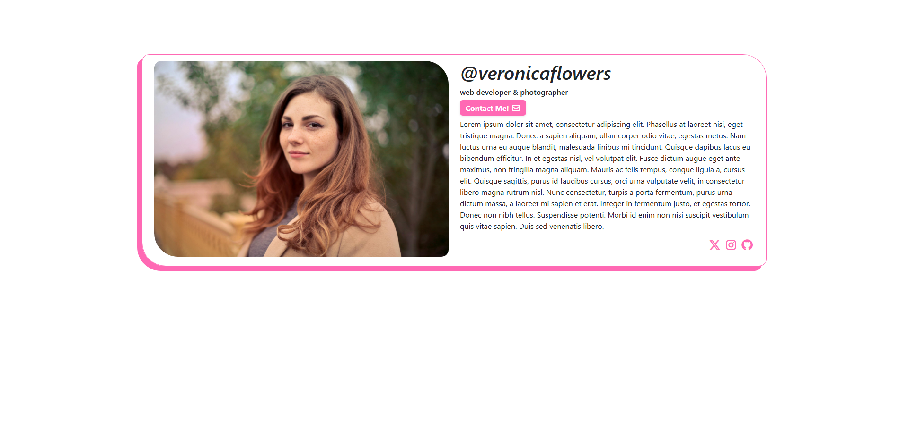

# Simple Link in Bio Template!

A simple and responsive link-in-bio page. Maybe for your sister!

## 📸 Preview



## 🌐 Live Demo

[View Live](https://jiggyflyjoe.github.io/cv-template/)

## 📖 About The Project

I'm learning web development and how to code. I just started learning how to use Bootstrap along with my vanilla HTML5 and CSS3 skills, and wanted to practice with something simple that could also be used for a portfolio project.

So I wound up making this. While I created it with my sister in mind, it could be easily changed and customized with different colors, photos, icons, etc., to work for anyone!

## 🎯 Features

- Clean and responsive layout
- Custom styling
- Accessible markup
- Social media icons via Font Awesome

## 🚀 Launch It!

```bash
git clone https://github.com/YOUR_USERNAME/REPO_NAME.git```
